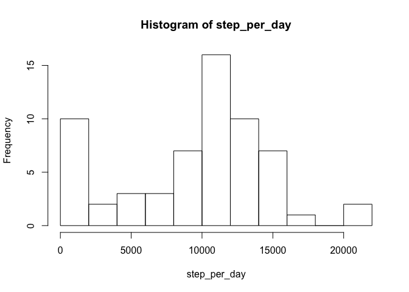
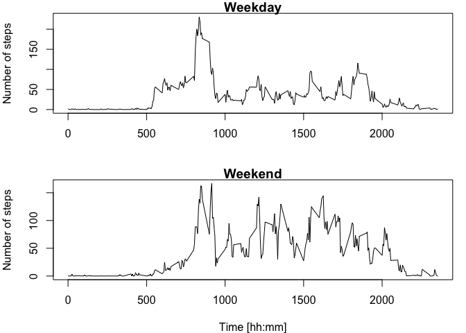

# Reproducible Research: Peer Assessment 1


## Loading and preprocessing the data
1. Load the data (i.e. read.csv())

```r
df <- read.csv("activity.csv")
```

2. Process/transform the data (if necessary) into a format suitable for your analysis  
No transformation applied.


## What is mean total number of steps taken per day?
1. Calculate the total number of steps taken per day

```r
step_per_day <- tapply(df$steps,df$date,sum,na.rm=TRUE) #i ignore NA values
```

2. Make a histogram of the total number of steps taken each day

```r
hist(step_per_day,breaks=10)
```

 

3. Calculate and report the mean and median of the total number of steps taken per day

```r
c(mean(step_per_day),median(step_per_day))
```

```
## [1]  9354.23 10395.00
```


## What is the average daily activity pattern?
1. Make a time series plot (i.e. type = "l") of the 5-minute interval (x-axis) and the average number of steps taken, averaged across all days (y-axis)

```r
time_series <- tapply(df$step,df$interval,mean,na.rm=TRUE)
plot(unique(df$interval),time_series,xlab="Interval [hh:mm]",ylab="Average step number",type="l")
```

 

2. Which 5-minute interval, on average across all the days in the dataset, contains the maximum number of steps?

```r
max_interval <- time_series[(time_series==max(time_series))]
names(max_interval) #print the interval value
```

```
## [1] "835"
```

## Imputing missing values
1. Calculate and report the total number of missing values in the dataset (i.e. the total number of rows with NAs)


```r
sum(is.na(df))
```

```
## [1] 2304
```

2. Devise a strategy for filling in all of the missing values in the dataset.  
I choose to replace NA values by the mean accross all days at the same interval value.

```r
step_is_na <- df[is.na(df$steps),]
step_is_na$steps <- time_series[as.character(step_is_na$interval)] #replace NA by time_series values
```

3. Create a new dataset that is equal to the original dataset but with the missing data filled in.

```r
df2 <- df #make a copy of the old dataset
df2[is.na(df$steps),] <- step_is_na #replace old by new data
```

4. a) Make a histogram of the total number of steps taken each day

```r
step_per_day2 <- tapply(df2$step,df2$date,sum) #essentially the same than first histogram
hist(step_per_day2,breaks=10)
```

 

4. b) Calculate and report the mean and median total number of steps taken per day.

```r
c(mean(step_per_day2),median(step_per_day2))
```

```
## [1] 10766.19 10766.19
```

5. Do these values differ from the estimates from the first part of the assignment? What is the impact of imputing missing data on the estimates of the total daily number of steps?  
Yes, the estimates differ. There was a significant number of NA (8 out 61 rows,ie 13%) as can be seen in the first histogram. As an effect, the mean and the median were underestimated. After imput, the mean was increased from 9354.23 to 10766.19 (increased by a factor of 1.15).


## Are there differences in activity patterns between weekdays and weekends?
1. Create a new factor variable in the dataset with two levels – “weekday” and “weekend” indicating whether a given date is a weekday or weekend day.

```r
library(timeDate) #necessary to use isWeekend function
library(plyr) #necessary to use mapvalues function
df2$is.weekend <- as.factor(isWeekend(df2$date)) #create factor (weekday=FALSE < weekend=TRUE)
df2$is.weekend <- mapvalues(df2$is.weekend,c(FALSE,TRUE),c("weekday","weekend")) #replace boolean by explicit names
```


2. Make a panel plot containing a time series plot (i.e. type = "l") of the 5-minute interval (x-axis) and the average number of steps taken, averaged across all weekday days or weekend days (y-axis).

```r
is_weekday <- df2$is.weekend == "weekday"
is_weekend <- df2$is.weekend == "weekend"
time_series2_weekday <- tapply(df2$steps[is_weekday],df2$interval[is_weekday],mean,na.rm=TRUE)
time_series2_weekend <- tapply(df2$steps[is_weekend],df2$interval[is_weekend],mean,na.rm=TRUE)
layout(c(1,2))
par(mar=c(4,4,1,1))
plot(x=as.numeric(rownames(time_series2_weekday)),y=time_series2_weekday,type="l",xlab="",ylab="Number of steps",main="Weekday")
plot(x=as.numeric(rownames(time_series2_weekend)),y=time_series2_weekend,type="l",xlab="Time [hh:mm]",ylab="Number of steps",main="Weekend")
```

 


